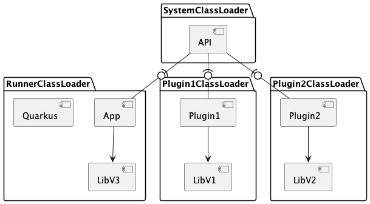

# Quarkus Isolated Runtime Plugins

## Use Case

Extensible application with plugin based architecture. Plugins are deployed not in build time.
- [keycloak](https://github.com/keycloak/keycloak/blob/3f6925143aa8a3e61c30782029ca5ea781d60ce0/services/src/main/java/org/keycloak/provider/FileSystemProviderLoaderFactory.java)
## Problem

Each plugin may have different release cycle and a try to run the application with plugins may lead to dependencies
incompatibility.
E.g. plugin1 requires lib of version 1, plugin2 requires lib of version 2, application uses lib of version 3.
This is a common issue called "jar-hell" and it doesn't have good solution (except probably jigsaw, which is still not
commonly used).

For some cases, it's possible to extract plugins to separate processes and communicate via IPC or some network protocol.
However, this brings additional effort to support these deployment units in runtime and bigger resource utilization due
to multiple running JVM, data serialization, etc.

## Solution

Each plugin and application is loaded by isolated ClassLoaders whose parent ClassLoader loads API module.
So that, application and plugins can have different versions of dependencies and safely interact via API module.
Solution utilizes Java SPI capability.



[Example implementation (not extension)](./app/src/main/java/org/example/app/irp)

### Quarkus

API/SPI classes should be located in dedicated api module which should be loaded by `System ClassLoader`.
This can be done by specifying api module in quarkus parent-first-artifacts:

```
quarkus.class-loading.parent-first-artifacts=<api-group-id>:<api-artifact-id>
```
[application.properties](./app/src/main/resources/application.properties)


### Best Practices

#### API module must follow [semantic API versioning](https://semver.org/)

This means, that API module doesn't evolve in a backward incompatible way in minor/patch release.
Because of that, application and it's API module should be versioned separately.  
This brings ability to have single plugin release per major release of **API** module (not an application)
which brings much more lifetime of each plugin release.

Example plugin compatibility matrix:

| App/Based on API | API Version change reason                        | 1.0.0 | 1.1.0 | 2.0.0 |
|------------------|--------------------------------------------------|-------|-------|-------|
| 23.1/1.0.0       |                                                  | +     | -     | -     |
| 23.2/1.0.0       |                                                  | +     | -     | -     |
| 23.3/1.1.0       | Upgrading minor version of API module dependency | +     | +     | -     |
| 23.4/1.1.0       |                                                  | +     | +     | -     |
| 24.1/1.1.0       |                                                  | +     | +     | -     |
| 24.2/1.1.0       |                                                  | +     | +     | -     |
| 24.3/1.1.0       |                                                  | +     | +     | -     |
| 24.4/1.1.0       |                                                  | +     | +     | -     |
| 25.1/2.0.0       | Upgrading Java version                           | -     | -     | +     |

Note that, each application/plugin release may upgrade / remove / add dependencies, migrate to newer library or even Quarkus
major version.
It will not break application or plugins because each plugin is loaded by isolated ClassLoader as long as there no breaking changes in
API module.
In case of breaking change in API module, major version should be increased and new plugin release should be released
for this version.

Migration to new java should be reflected to API module as increasing of major version because there can be removals
in JDK which are still used by some plugin (e.g. removal of SecurityManager).

#### API module should export minimal and sufficient capabilities and dependencies

Because all of API module's dependencies should be loaded within same ClassLoader which loaded API module. If plugin has
different version of this dependency while deployed, some class loading error for plugin may occur.

If API module depends on some library, upgrading this library should be done within upgrading of API module version
according to semantic versioning guideline.

### Limitations

#### Doesn't work in native images

Dynamic class loading is not supported in native images (yet?)

#### Plugins don't have access to Quarkus (e.g. smallrye config) and application internal services which is not exported to an API module

Because application is loaded by isolated ClassLoader itself.
However, this is exactly what is needed for plugin for most cases and clean architecture. Plugin should not relay on
internal API and have ability to use all application's functionality.
Plugin may use only limited functionality provided by API module especially designed and supported for them.
Each plugin is configured and initialized by user code in a way which applied developers designed.

However, this allows to upgrade Quarkus without affecting plugins.

### Run this example
API module defined an API [ExampleService](./api/src/main/java/org/example/app/api/ExampleService.java) and SPI to load it by ServiceLoader
[ExampleServiceFactory](./api/src/main/java/org/example/app/api/spi/ExampleServiceFactory.java)

There are two plugins which uses different versions of lib and provides implementations for this API.
Also, application itself provides implementation of plugin while using another version of lib.


To run  image and mount dirs where plugin jars are located:
```bash
mvn clean install && docker-compose up --build
```
It should print to console:
```
INFO  [org.exa.app.App] (main) Calling org.example.lib.Lib#methodV1() loaded from plugin1
INFO  [org.exa.app.App] (main) Calling org.example.lib.Lib#methodV2() loaded from plugin2
INFO  [org.exa.app.App] (main) Calling org.example.lib.Lib#methodV3() loaded from null
```